# Projeto Final - Gerenciador de Tarefas

# Informações Gerais
- Curso: Sistemas para Internet
- Instituição: Instituto Federal do Acre — Ifac
🔗 Site: https://www.ifac.edu.br/
- Professor: [Jonas Pontes]
🔗 Lattes: [http://lattes.cnpq.br/3068708429112735]

## 1. Integrantes do Grupo

* Giovanna Souza Correia
* Vínicius Barros de Melo

## 2. Descrição Geral do Problema e da Solução

### Problema

> Indivíduos, sejam estudantes ou profissionais, frequentemente lidam com uma variedade de tarefas de diferentes naturezas (trabalho, estudo, pessoal) e com diferentes requisitos (prazos, projetos associados, etc.). A falta de uma ferramenta centralizada e simples para organizar essas atividades pode levar à perda de controle, esquecimento de compromissos e queda na produtividade.

### Solução Proposta

> Foi desenvolvida uma aplicação de console em Java que atua como um sistema de gerenciamento de tarefas. A solução permite ao usuário catalogar, consultar e gerenciar suas atividades de forma estruturada. O sistema foi modelado utilizando os princípios da Programação Orientada a Objetos para representar de forma fiel as diferentes características de cada tipo de tarefa, garantindo um código organizado, coeso e extensível.

## 3. Requisitos Funcionais

* **RF01:** O sistema deve permitir ao usuário adicionar novas tarefas, especificando seu tipo (Trabalho, Estudo ou Pessoal).
* **RF02:** O sistema deve permitir agendar uma tarefa para uma data específica (passado, presente ou futuro) ou para o dia atual por padrão.
* **RF03:** O sistema deve permitir a listagem de todas as tarefas pendentes, ordenadas pela ordem de criação.
* **RF04:** O sistema deve permitir a listagem de todas as tarefas já concluídas, servindo como um histórico.
* **RF05:** O sistema deve permitir que o usuário marque uma tarefa pendente como concluída.
* **RF06:** O sistema deve permitir a busca e exibição de todas as tarefas (pendentes ou concluídas) agendadas para uma data específica.
* **RF07:** A interface com o usuário deve aceitar e exibir datas no formato brasileiro (DD/MM/AAAA).

## 4. Casos de Uso (Fluxos Principais)

### UC01: Adicionar Nova Tarefa

* **Ator:** Usuário
* **Fluxo Principal:**
    1.  O usuário seleciona a opção "Adicionar Nova Tarefa" no menu.
    2.  O sistema solicita a data de agendamento da tarefa, permitindo entrada em branco para o dia atual.
    3.  O sistema solicita o tipo de tarefa (Trabalho, Estudo ou Pessoal).
    4.  O sistema solicita os dados comuns: Título e Descrição.
    5.  Com base no tipo, o sistema solicita os dados específicos (ex: Prazo para Trabalho, Disciplina para Estudo, Categoria para Pessoal).
    6.  O sistema cria o objeto da tarefa correspondente e o armazena.
    7.  O sistema exibe a mensagem "Tarefa adicionada com sucesso!".

### UC02: Listar Tarefas Pendentes

* **Ator:** Usuário
* **Fluxo Principal:**
    1.  O usuário seleciona a opção "Listar Tarefas Pendentes".
    2.  O sistema busca todas as tarefas armazenadas.
    3.  O sistema filtra as tarefas, mantendo apenas aquelas cujo estado é "não concluída".
    4.  O sistema exibe uma lista numerada com os detalhes de cada tarefa pendente.
    5.  Caso não existam tarefas pendentes, uma mensagem informativa é exibida.

### UC03: Marcar Tarefa como Concluída

* **Ator:** Usuário
* **Fluxo Principal:**
    1.  O usuário seleciona a opção "Marcar Tarefa como Concluída".
    2.  O sistema exibe a lista de tarefas pendentes (reutilizando o UC02).
    3.  O sistema solicita que o usuário digite o número da tarefa a ser concluída.
    4.  O sistema localiza a tarefa correspondente e altera seu estado para "concluída".
    5.  O sistema exibe a mensagem "Tarefa marcada como concluída com sucesso!".

### UC04: Buscar Tarefas por Data de Agendamento

* **Ator:** Usuário
* **Fluxo Principal:**
    1.  O usuário seleciona a opção "Buscar Tarefas por Data de Agendamento".
    2.  O sistema solicita que o usuário digite uma data no formato DD/MM/AAAA.
    3.  O sistema busca todas as tarefas armazenadas.
    4.  O sistema filtra as tarefas, mantendo apenas aquelas cuja data de agendamento corresponde à data informada.
    5.  O sistema exibe uma lista com os detalhes de cada tarefa encontrada, indicando seu status (Pendente ou Concluída).

## 5. Diagrama de Classes

O diagrama abaixo representa a arquitetura principal do sistema, com foco nas classes de modelo e seus relacionamentos, bem como a interação entre as camadas da aplicação.

```mermaid
classDiagram
    direction LR

    class Tarefa {
        <<Abstract>>
        -titulo: String
        -descricao: String
        -concluida: boolean
        -dataAgendamento: LocalDate
        +marcarConclida(): void
        +exibirDetalhes(): String*
        #formatarData(LocalDate): String
    }

    class TarefaTrabalho {
        -prazo: LocalDate
        -projeto: Optional~String~
        +exibirDetalhes(): String
    }

    class TarefaEstudo {
        -disciplina: String
        -dataEntrega: LocalDate
        +exibirDetalhes(): String
    }

    class TarefaPessoal {
        -categoria: String
        -prazo: Optional~LocalDate~
        +exibirDetalhes(): String
    }

    class TarefaServico {
        -tarefaDao: TarefaDao
        +adicionarTarefaTrabalho(titulo: String, desc: String, dataAgend: LocalDate, prazo: LocalDate, proj: Optional~String~): void
        +adicionarTarefaEstudo(titulo: String, desc: String, dataAgend: LocalDate, disc: String, dataEnt: LocalDate): void
        +adicionarTarefaPessoal(titulo: String, desc: String, dataAgend: LocalDate, cat: String, prazo: Optional~LocalDate~): void
        +listarTarefasPendentes(): List~Tarefa~
        +listarTarefasConcluidas(): List~Tarefa~
        +concluirTarefa(indice: int): boolean
        +buscarTarefasPorDataDeAgendamento(data: LocalDate): List~Tarefa~
    }

    class TarefaDao {
        -tarefas: List~Tarefa~
        +salvar(Tarefa tarefa): void
        +listarTodas(): List~Tarefa~
    }
    
    class MenuUsuario {
      -tarefaServico: TarefaServico
      -console: Console
      -formatadorData: DateTimeFormatter
      +iniciar(): void
      -exibirMenuPrincipal(): void
      -lerData(): LocalDate
      -adicionarTarefaTrabalhoUI(...): void
      -adicionarTarefaEstudoUI(...): void
      -adicionarTarefaPessoalUI(...): void
      -adicionarNovaTarefaUI(): void
      -listarTarefasPendentesUI(): void
      -listarTarefasConcluidasUI(): void
      -concluirTarefaUI(): void
      -buscarPorDataUI(): void
    }

    class Main {
      +main(String[] args): void
    }

    Tarefa <|-- TarefaTrabalho : herda de
    Tarefa <|-- TarefaEstudo : herda de
    Tarefa <|-- TarefaPessoal : herda de
    
    Main ..> MenuUsuario : usa
    MenuUsuario ..> TarefaServico : usa
    TarefaServico ..> TarefaDao : usa
    TarefaServico ..> Tarefa : cria/manipula
    TarefaDao ..> Tarefa : armazena
```

